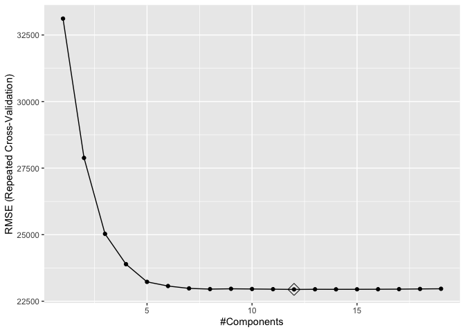
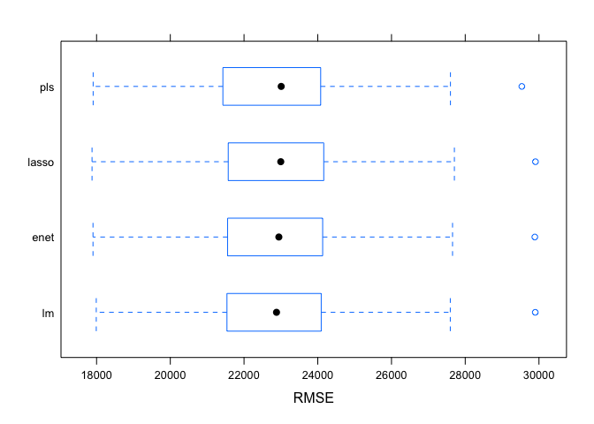

P8106 Data Science II Homework 1: Predicting the Sale Price of a House
Using Characteristics
================
Sarah Forrest - sef2183
2/22/2023

# Data

In this exercise, we predict the sale price of a house using its other
characteristics. The training data are in “housing train.csv”, and the
test data are in “housing test.csv”.

``` r
# read in test data
test_data = read.csv("data/housing_test.csv") 
# read in training data
train_data = read.csv("data/housing_training.csv")
```

Create six input objects for use in the proceeding code:

1.  x = input matrix of predictors x for the training data using
    `model.matrix()`

2.  y = vector of response y for the training data

3.  x2 = input matrix of predictors x for the test data using
    `model.matrix()`

4.  y2 = vector of response y for the test data

5.  ctrl1 = 10-fold cross-validation repeated 5 times using
    `trainControl()` and the default “best” minimum MSE rule

6.  ctrl_1se = 10-fold cross-validation repeated 5 times using
    `trainControl()` and the 1 standard error (1SE) rule

``` r
set.seed(1)

# training data
x <- model.matrix(Sale_Price ~ ., train_data)[ ,-1]
y <- train_data$Sale_Price

# test data
x2 <- model.matrix(Sale_Price ~ ., test_data)[ ,-1]
y2 <- test_data$Sale_Price

# 10-fold cross-validation repeated 5 times 
## best rule
ctrl1 <- trainControl(method = "repeatedcv", number = 10, repeats = 5)
## 1SE rule
ctrl_1se <- trainControl(method = "repeatedcv", selection = "oneSE", number = 10, repeats = 5)
```

# (a) Fit a linear model using least squares on the training data

Using the caret package:

``` r
set.seed(1)

lm_fit <- train(x, y,
                method = "lm",
                trControl = ctrl1)
```

# (b) Fit a lasso model on the training data

Using the caret package:

``` r
set.seed(1)

lasso_fit <- train(x, y,
                   method = "glmnet",
                   tuneGrid = expand.grid(alpha = 1,
                                          lambda = exp(seq(-1, 5, length = 100))),
                   trControl = ctrl1)
```

## (bi) Tuning parameter (lambda)

``` r
lasso_fit$bestTune
```

    ##    alpha   lambda
    ## 86     1 63.53019

The best lambda value resulting in the minimum mean-square error (MSE)
according to the caret package is 63.53019.

## (bii) Test error

``` r
set.seed(1)

lasso_fit_pred <- predict(lasso_fit, newdata = x2)

# calculate MSE
mean((lasso_fit_pred - y2)^2)
```

    ## [1] 440154088

``` r
# calculate RMSE
sqrt(mean((lasso_fit_pred - y2)^2)) 
```

    ## [1] 20979.85

The mean-square test error (MSE) for the lasso model is 440,154,088. The
root-mean-square test error (RMSE) for the lasso model is 20,979.85.

## (biii) Predictors

``` r
set.seed(1)

lasso_fit_1se <- train(x, y,
                   method = "glmnet",
                   tuneGrid = expand.grid(alpha = 1,
                                          lambda = exp(seq(-1, 5, length = 100))),
                   trControl = ctrl_1se)

coef(lasso_fit_1se$finalModel, lasso_fit_1se$bestTune$lambda)
```

    ## 40 x 1 sparse Matrix of class "dgCMatrix"
    ##                                       s1
    ## (Intercept)                -4.622105e+06
    ## Gr_Liv_Area                 6.430183e+01
    ## First_Flr_SF                8.502170e-01
    ## Second_Flr_SF               .           
    ## Total_Bsmt_SF               3.569211e+01
    ## Low_Qual_Fin_SF            -3.974325e+01
    ## Wood_Deck_SF                1.118852e+01
    ## Open_Porch_SF               1.455212e+01
    ## Bsmt_Unf_SF                -2.086635e+01
    ## Mas_Vnr_Area                1.142289e+01
    ## Garage_Cars                 3.990550e+03
    ## Garage_Area                 8.403058e+00
    ## Year_Built                  3.210443e+02
    ## TotRms_AbvGrd              -3.351443e+03
    ## Full_Bath                  -3.257826e+03
    ## Overall_QualAverage        -4.626664e+03
    ## Overall_QualBelow_Average  -1.200988e+04
    ## Overall_QualExcellent       7.852120e+04
    ## Overall_QualFair           -1.020984e+04
    ## Overall_QualGood            1.188611e+04
    ## Overall_QualVery_Excellent  1.413225e+05
    ## Overall_QualVery_Good       3.769571e+04
    ## Kitchen_QualFair           -2.262179e+04
    ## Kitchen_QualGood           -1.524818e+04
    ## Kitchen_QualTypical        -2.350509e+04
    ## Fireplaces                  9.642085e+03
    ## Fireplace_QuFair           -7.387701e+03
    ## Fireplace_QuGood            .           
    ## Fireplace_QuNo_Fireplace    .           
    ## Fireplace_QuPoor           -5.351245e+03
    ## Fireplace_QuTypical        -6.957962e+03
    ## Exter_QualFair             -2.806119e+04
    ## Exter_QualGood             -1.016167e+04
    ## Exter_QualTypical          -1.467782e+04
    ## Lot_Frontage                9.629951e+01
    ## Lot_Area                    6.025532e-01
    ## Longitude                  -3.061524e+04
    ## Latitude                    5.043366e+04
    ## Misc_Val                    7.111446e-01
    ## Year_Sold                  -4.581742e+02

When the 1SE rule is applied, there are 36 predictors included in the
model (not including the intercept). The following coefficients were
removed from the model because they had values of 0: second floor square
feet (Second_Flr_SF), “good” fireplace quality
(Fireplace_QuNo_Fireplace), and no fireplace (Fireplace_QuNo_Fireplace )

# (c) Fit an elastic net model on the training data

Using the caret package:

``` r
set.seed(1)

enet_fit <- train(x, y,
                  method = "glmnet",
                  tuneGrid = expand.grid(alpha = seq(0, 1, length = 21), 
                                         lambda = exp(seq(2, -2, length = 50))),
                  trControl = ctrl1)
```

## (bi) Tuning parameters (alpha and lambda)

``` r
enet_fit$bestTune
```

    ##     alpha   lambda
    ## 700  0.65 7.389056

The best alpha value using the minimum MSE rule according to the caret
package is 0.65. The best lambda value using the minimum MSE rule
according to the caret package is 7.389056.

``` r
set.seed(1)

enet_fit_1se <- train(x, y,
                  method = "glmnet",
                  tuneGrid = expand.grid(alpha = seq(0, 1, length = 21), 
                                         lambda = exp(seq(2, -2, length = 50))),
                  trControl = ctrl_1se)

enet_fit_1se$bestTune
```

    ##    alpha   lambda
    ## 50     0 7.389056

It is possible to apply the 1SE rule to select the tuning parameters by
adding a selection = “oneSE” statement to the `trainControl` function.
When the 1SE rule is applied, the The best alpha value using the 1SE
rule is 0. The best lambda value using the 1SE rule is 7.389056.

## (bii) Test error

``` r
set.seed(1)

enet_fit_pred <- predict(enet_fit, newdata = x2)

# calculate MSE
mean((enet_fit_pred - y2)^2)
```

    ## [1] 442815907

``` r
# calculate RMSE
sqrt(mean((enet_fit_pred - y2)^2)) 
```

    ## [1] 21043.19

The mean-square test error (MSE) for the elastic net model is
442,815,907. The root-mean-square test error (RMSE) for the elastic net
model is 21,043.19.

# (d) Fit a partial least squares model on the training data

``` r
set.seed(1)

pls_fit <- train(x, y,
                 method = "pls",
                 tuneGrid = data.frame(ncomp = 1:19), trControl = ctrl1,
                 preProcess = c("center", "scale"))
```

## (bi) Test error

``` r
set.seed(1)

pls_fit_pred <- predict(pls_fit, newdata = x2)

# calculate MSE
mean((pls_fit_pred - y2)^2)
```

    ## [1] 449622718

``` r
# calculate RMSE
sqrt(mean((pls_fit_pred - y2)^2)) 
```

    ## [1] 21204.31

The mean-square test error (MSE) for the partial least squares model is
449,622,718. The root-mean-square test error (RMSE) for the partial
least squares model is 21,204.31.

## (bii) Model components

``` r
ggplot(pls_fit, highlight = TRUE)
```

<!-- -->

There are 12 components included in the model.

# (e) Model Comparison

``` r
set.seed(1)

resamp <- resamples(list(
  pls = pls_fit,
  enet = enet_fit, 
  lasso = lasso_fit,
  lm = lm_fit)) 

summary(resamp)
```

    ## 
    ## Call:
    ## summary.resamples(object = resamp)
    ## 
    ## Models: pls, enet, lasso, lm 
    ## Number of resamples: 50 
    ## 
    ## MAE 
    ##           Min.  1st Qu.   Median     Mean  3rd Qu.     Max. NA's
    ## pls   13541.68 16090.73 16727.26 16716.20 17492.65 19113.09    0
    ## enet  13552.26 15978.41 16666.35 16674.21 17464.16 19131.98    0
    ## lasso 13537.95 15959.24 16652.03 16656.71 17452.05 19127.14    0
    ## lm    13590.23 16046.61 16694.90 16712.84 17491.07 19148.35    0
    ## 
    ## RMSE 
    ##           Min.  1st Qu.   Median     Mean  3rd Qu.     Max. NA's
    ## pls   17907.12 21463.52 23008.08 22943.72 24070.28 29535.42    0
    ## enet  17902.91 21580.65 22944.50 22947.71 24112.85 29887.80    0
    ## lasso 17876.73 21592.86 22996.36 22941.16 24142.95 29904.83    0
    ## lm    17991.36 21596.77 22880.98 22978.67 24085.83 29899.57    0
    ## 
    ## Rsquared 
    ##            Min.   1st Qu.    Median      Mean   3rd Qu.      Max. NA's
    ## pls   0.8603467 0.8921784 0.9071393 0.9030770 0.9155912 0.9392286    0
    ## enet  0.8604257 0.8924981 0.9062574 0.9031143 0.9149761 0.9393103    0
    ## lasso 0.8605682 0.8924789 0.9073967 0.9031728 0.9149580 0.9394469    0
    ## lm    0.8600209 0.8924164 0.9059332 0.9028661 0.9149852 0.9387696    0

``` r
bwplot(resamp, metric = "RMSE")
```

<!-- -->

The best model that I would choose for predicting the sale price of a
house is the lasso model. The reason for choosing this model is because
it has the lowest mean value for RMSE.
